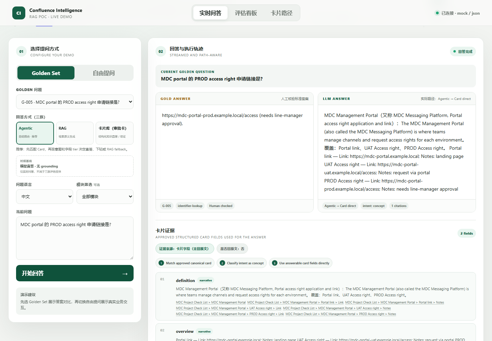
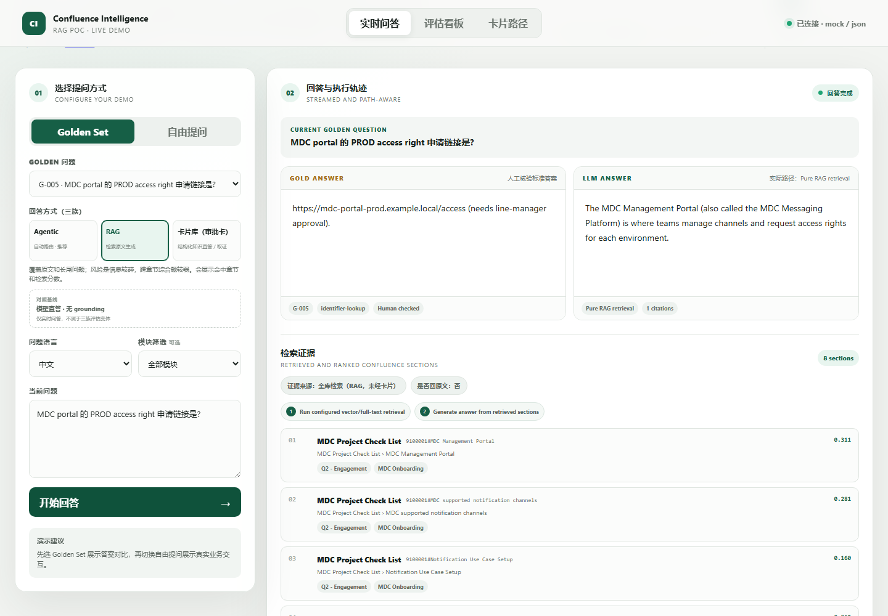
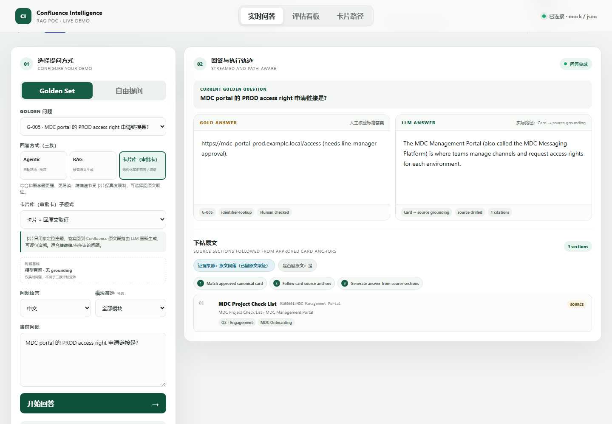
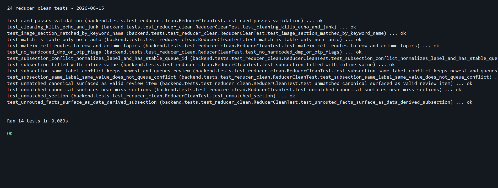
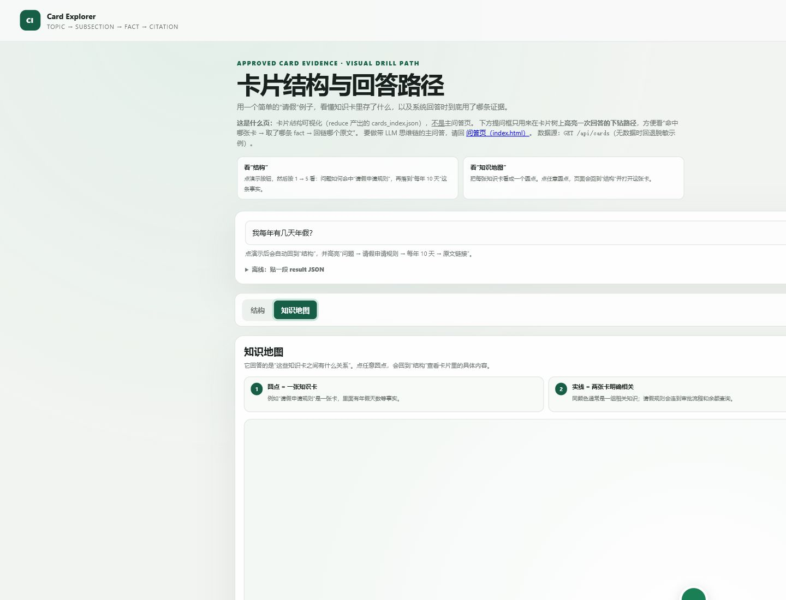

# 23 号前端汇报澄清：完成检阅回报

**检阅日期：2026-06-15**

## 结论

`23_CODEX_前端汇报澄清_直答取证_证据来源_命名.md` 要求的前端澄清工作已经完成并通过检阅。

检阅过程中发现一项未完成工作：`backend/tests/test_pipeline.py` 仍断言旧的人类可见名称 `LLM + Wiki`。该断言已改为验证新名称 `卡片库（审批卡）`，并增加了覆盖 23 号规格关键约束的专项回归测试。

目前没有阻塞交付的问题。全部 73 项自动化测试通过，真实浏览器中的三族回答路径、卡片直答与回原文取证路径均工作正常。

## 已完成工作

### 原实现检阅

- `frontend/index.html`
  - 增加卡片模式实时说明区域。
  - 增加回答证据来源展示区域。
  - 人类可见名称改为 `卡片库（审批卡）`。
  - 主问答页职责说明已对齐。
- `frontend/app.js`
  - 卡片直答与卡片回原文取证的说明文案会随选择实时更新。
  - 根据 `execution.evidence_kind` 渲染四种证据来源徽标。
  - 根据 `execution.drilled` 或 `result.drilled` 渲染“是否回原文”。
  - 仅修改人类可见文案，内部族键和 API 模式值保持不变。
- `frontend/style.css`
  - 增加模式说明和证据徽标样式。
- `frontend/cards.html`
  - 页面职责及提问操作文案对齐为“演示一次回答的下钻路径”。
- `frontend/flow.html`
  - 人类可见旧名称完成替换。

### 本次补齐

- 新增 `backend/tests/test_frontend_clarity.py`，固定以下回归约束：
  - 两种卡片模式说明文案准确且具备实时更新绑定。
  - 证据来源四态及是否回原文徽标完整。
  - 人类可见的 `LLM + Wiki` 已全部移除。
  - `data-answer-family`、`answer_mode`、option value 和元素 id 等内部契约未改变。
  - 主问答页与卡片库页面的唯一职责说明存在。
- 修复 `backend/tests/test_pipeline.py` 中仍断言旧名称的测试。
- 补充三族脱敏 Golden 截图证据。

## 验收结果

| 验收项 | 结果 | 检阅说明 |
|---|---|---|
| 切换卡片直答/卡片取证时说明实时更新 | 通过 | 两段指定文案准确；浏览器切换后即时更新 |
| 回答后显示证据来源四态及是否回原文 | 通过 | `card`、`source`、`retrieval`、`none` 均已验证 |
| 可见名称改为卡片库（审批卡） | 通过 | 前端未检出人类可见的 `LLM + Wiki` |
| 内部族键与回答模式契约保持不变 | 通过 | `llm-wiki`、`card-direct`、`card-grounding`、`pure-rag`、`llm-direct` 均保持原值 |
| Pure RAG 与模型直答路径不报错 | 通过 | 分别显示全库检索与无可验证证据 |
| 纯静态、无新增依赖、无硬编码内网数据 | 通过 | 未引入框架、打包工具或新依赖 |
| 每页唯一职责说明清楚 | 通过 | 主问答页与卡片库页职责已对齐 |

## 浏览器实测

使用 Golden 问题 `G-005` 对四条回答路径进行了真实 API 与浏览器验证：

| 回答路径 | 证据来源显示 | 是否回原文 |
|---|---|---|
| Agentic / 卡片直答 | 证据来源：卡片字段（未回原文） | 否 |
| RAG / Pure RAG | 证据来源：全库检索（RAG，未经卡片） | 否 |
| 卡片库 / 卡片+回原文取证 | 证据来源：原文段落（已回原文取证） | 是 |
| 模型直答基线 | 无可验证证据 | 否 |

浏览器控制台未发现错误。

## 自动化验证

- `uv run python -m unittest discover -s backend/tests -v`
  - 结果：`Ran 73 tests`，`OK`
- `node --check frontend/app.js`
  - 结果：通过
- `frontend/cards.html` 内联脚本语法检查
  - 结果：通过
- 前端旧名称静态检索
  - 结果：未发现 `LLM + Wiki`、`本地 Wiki` 或 `Wiki 卡片`
- `git diff --check`
  - 结果：通过

测试期间仅出现 Starlette/httpx 的弃用警告，与 23 号前端澄清工作无关，不影响功能。

## 截图证据

### Agentic：卡片直答

### RAG：全库检索

### 卡片库：回原文取证

## 涉及文件

- 原实现：`frontend/index.html`、`frontend/app.js`、`frontend/style.css`、`frontend/cards.html`、`frontend/flow.html`
- 本次补齐：`backend/tests/test_frontend_clarity.py`、`backend/tests/test_pipeline.py`
- 检阅证据：`handoff/evidence_23/`
- 原实现提交：`d6b2a99 Add evidence clarity, fact conflicts, and knowledge map`

---

# 24 号 subsection 同标签多值冲突：完成检阅回报

## 结论

`24_CODEX_矛盾检测扩展_subsection同标签多值冲突.md` 要求的核心功能已经在原实现提交 `d6b2a99` 中落地：

- subsection facts 按规范化后的 label 分组。
- `inline-value` 与 `narrative` 的同标签不同值会被判定为冲突。
- 按 `update_at`、`confluence_version` 选取最新展示值。
- 冲突进入 `review_queue`，卡片追加冲突 flag。
- 同标签同值不会误报。
- 检测逻辑确定性、离线，不调用 LLM，也没有修改匹配归属逻辑或既有 `merge_config_field`。

检阅发现一项未完成的稳定性约束：实现虽然按规范化 label 分组，但 `fact-conflict` 的 `queue_id` 使用最新事实的原始 label 生成。若同一标签仅大小写或空格不同，或者最新来源发生变化，队列 ID 会漂移，无法可靠稳定去重。

该问题已补齐：冲突元数据现在保留规范化 label，`queue_id` 使用 subsection 名与规范化 label 生成稳定的 8 位 hash；面向 owner 的 `field`、`detail` 仍保留最新事实的原始可读 label。

## 24 号验收结果

| 验收项 | 结果 | 检阅说明 |
|---|---|---|
| 按规范化 label 检测同标签不同值 | 通过 | 大小写及首尾空格不同的 label 会归入同一冲突组 |
| 仅处理有值的 `inline-value` / `narrative` fact | 通过 | pointer-only 不参与冲突检测 |
| 使用 `clean_inline_value` 后的值判断冲突 | 通过 | 冲突判定保持确定性 |
| 最新展示值按日期、版本号降序选择 | 通过 | 旧值从展示 facts 移除，最新值保留 |
| 生成合法 `fact-conflict` review item | 通过 | 包含稳定 queue ID、field、detail、options、status |
| options 标注 page/version/update_at | 通过 | owner 可依据来源信息人工裁决 |
| 卡片追加 subsection 冲突 flag | 通过 | flag 包含 subsection 与 label |
| 同标签同值不产生误报 | 通过 | 反例测试通过 |
| queue ID 稳定可去重 | 通过 | 本次补齐规范化 label 哈希及专项回归测试 |
| 不调用 LLM、不改匹配逻辑、不动 config 冲突逻辑 | 通过 | 冲突解析与 review item 构建均为纯确定性函数 |

## 本次补齐

- `backend/reducer/service.py`
  - `resolve_subsection_fact_conflicts` 将规范化后的 label 写入内部冲突元数据。
  - `fact_conflict_item` 使用规范化 label 生成稳定 queue ID。
- `backend/tests/test_reducer_clean.py`
  - 新增 label 大小写/空格变体归组测试。
  - 新增“最新来源变化后 queue ID 仍稳定”的回归断言。
  - 验证不同最新来源下展示值仍正确。

## 24 号验证结果

- `uv run python -m unittest backend.tests.test_reducer_clean -v`
  - 结果：`Ran 14 tests`，`OK`
- `uv run python -m unittest discover -s backend/tests -v`
  - 结果：`Ran 74 tests`，`OK`
- `git diff --check`
  - 结果：通过
- 静态检查
  - `resolve_subsection_fact_conflicts` 与 `fact_conflict_item` 内没有 LLM 调用。
  - 既有 `merge_config_field` 与 subsection 匹配归属逻辑未修改。

完整测试仅出现 Starlette/httpx 弃用警告，与 24 号 reducer 冲突检测无关，不影响功能。

## 24 号测试证据

原始脱敏测试输出：`handoff/evidence_24/24_reducer_clean_tests.txt`

---

# 25 号 cards.html 知识地图：完成检阅回报

## 结论

`25_CODEX_社区图可视化_cards.html知识地图.md` 要求的知识地图主体功能已经在原实现提交 `d6b2a99` 中完成，未发现阻塞交付的功能缺陷：

- `cards.html` 提供“结构 / 知识地图”视图切换，默认保持原结构视图。
- 从卡片 `related_components.soft_links` 构建无向去重边。
- 使用 vanilla SVG、朴素力导向布局与标签传播社区检测。
- 图较稀疏时回退为 module 着色，并提供图例。
- module 次级淡边默认关闭，可通过开关显示。
- 点击节点会切回结构视图并展开对应卡。
- API 不可用或无数据时，会使用四张纯脱敏“员工请假”知识卡渲染小图。
- 没有修改 backend/reduce 产品逻辑，也没有引入 CDN、框架或打包工具。

检阅发现的未完成项是缺少知识地图专项自动化回归测试。本次已新增 `backend/tests/test_cards_knowledge_map.py`，固定 25 号规格的核心前端契约。

## 25 号验收结果

| 验收项 | 结果 | 检阅说明 |
|---|---|---|
| 从 `/api/cards` 渲染卡片节点 | 通过 | 实际流水线输出成功渲染 7 个节点 |
| soft_links 渲染为无向去重边 | 通过 | 请假示例双向引用最终只显示 4 条明确关联；实际输出显示 1 条边 |
| 社区着色与 module 回退 | 通过 | 请假示例按相关知识分组；实际稀疏图自动回退业务模块分组 |
| 图例显示 | 通过 | 社区与 module 分组均生成对应图例 |
| module 淡边默认关闭并可选开启 | 通过 | 开关已改为“同时显示同一业务模块的弱关联（虚线）” |
| 点击节点回到结构视图并展开卡片 | 通过 | 点击“年假余额查询”后结构视图正确展开该卡 |
| hover tooltip 显示名称、module、度数 | 通过 | SVG `<title>` 包含三项信息 |
| 无边提示存在 | 通过 | 无 related_components 时显示指定提示 |
| API 无数据时回退脱敏示例 | 通过 | 示例含 4 张请假知识卡与去重 soft_links |
| 移动端可渲染 | 通过 | 移动视口下节点保持渲染，页面无额外横向溢出 |
| 纯 vanilla、无 CDN、无新依赖 | 通过 | 未发现外链脚本、vis.js、d3.js 或 CDN 引用 |
| 原结构视图功能不受影响 | 通过 | 节点回跳、卡片选择与详情展开均正常 |

## 本次补齐

- 新增 `backend/tests/test_cards_knowledge_map.py`，共 7 项专项回归测试：
  - 默认结构视图与视图切换控件。
  - related_components/soft_links 无向边去重。
  - 社区检测、module 回退、图例与无边提示。
  - 四张中文请假知识卡的离线回退与旧英文 Sample 清除。
  - 节点点击后选卡、回结构视图并展开详情。
  - 从知识地图点击回答演示后，强制回到结构视图并高亮证据。
  - vanilla 实现、无 CDN/第三方图形库及移动端样式。

## 浏览器实测

### 脱敏请假示例

- 节点：4，分别为“请假申请规则 / 请假审批流程 / 年假余额查询 / 请假问题找谁”
- related_components 无向去重边：4
- 默认着色：按相关知识分组
- 地图顶部直接解释“圆点 / 实线 / 点击圆点”的含义
- 点击“年假余额查询”：成功切回结构视图，并同时选中、展开该卡
- 在知识地图中点击“演示一次回答的下钻路径”：成功切回结构视图，选中“请假申请规则”，并高亮“每年 10 天”

### 实际 `/api/cards`

- 数据源：`outputs/cards_index.json`
- 节点：7
- related_components 无向去重边：1
- 图较稀疏，正确回退为 module 着色
- 浏览器控制台：无 warning/error

## 用户反馈后的二次改进

- 删除难以理解的 `Sample Service Support / Sample Runbook / Sample Escalation` 英文示例，统一替换为“员工请假”中文日常场景。
- 结构视图使用“我每年有几天年假？”演示完整路径，并把关键结果落到“请假申请规则 → 年假天数 → 每年 10 天”。
- 知识地图增加三步阅读说明，直接解释圆点、实线、颜色和点击行为；状态、tooltip、空图提示也改为中文人话。
- 回答演示按钮、实时结果和离线 result JSON 都会强制切回“结构”，避免用户在地图页点击后看不到下钻结果。
- 卡片分区、卡片级字段、搜索辅助信息及 1 → 5 回答阶段补充中文名称，保留必要的内部字段名供技术检阅。

## 25 号验证结果

- `uv run python -m unittest backend.tests.test_cards_knowledge_map -v`
  - 结果：`Ran 7 tests`，`OK`
- `uv run python -m unittest discover -s backend/tests -v`
  - 结果：`Ran 83 tests`，`OK`
- `node --check` 检查 `frontend/cards.html` 内联脚本
  - 结果：通过
- `git diff --check`
  - 结果：通过

完整测试仅出现 Starlette/httpx 弃用警告，与知识地图无关，不影响功能。

## 25 号截图证据

---

# index.html 无后端离线演示：用户反馈补充

## 结论

直接打开 `frontend/index.html` 或仅启动静态文件服务、没有后端 API 时，页面现在会自动进入醒目标注的“脱敏离线演示”模式，不再让实时问答和评估看板整体失效。

- 内置 4 个易懂的员工请假 Golden 问题。
- Agentic、RAG、卡片直答、卡片回原文取证、模型直答基线均可点击演示。
- 回答区继续展示实际路径、证据来源、是否回原文和执行步骤。
- 评估看板自动加载内置脱敏报告，三族对比、Variant、问题下钻均可操作。
- 顶部和演示建议明确标注当前为离线脱敏数据，避免被误认为真实 API 结果。
- 后端可用时保持原逻辑，继续读取真实 `/api/golden`、`/api/chat/stream` 与 `/api/eval-report`。

## 验证

- 无后端静态服务浏览器实测：自动显示“离线演示 · 无需后端”。
- 离线实时问答：成功显示 `Agentic → Card direct`、卡片字段和“每年 10 天”。
- 离线评估看板：成功渲染 4 个问题、4 个 Variant 与三族横向对比。
- 直接 `file://` 自动化访问受浏览器安全策略限制；代码层面直接双击与无 API 静态服务均进入同一个失败回退分支。
- `uv run python -m unittest discover -s backend/tests -v`：`Ran 83 tests`，`OK`。

## 离线 Mock 演示节奏与步骤高亮补充

根据演示反馈，离线 Mock 回答不再瞬间完成。点击“开始回答”后会先展示全部执行步骤，并按顺序逐步推进：

- 当前步骤停留约 1.6 秒，显示“进行中”并使用醒目高亮。
- 已走过的步骤保留“已完成”状态，尚未执行的步骤显示“等待”。
- 全部步骤完成后，才开始流式生成最终答案并展示证据。
- 上述人工演示节奏仅在离线 Mock 模式启用，真实后端问答不会被额外延迟。

新增前端回归检查，覆盖离线演示节奏参数、当前步骤语义标记，以及等待 / 进行中 / 已完成三种视觉状态。
